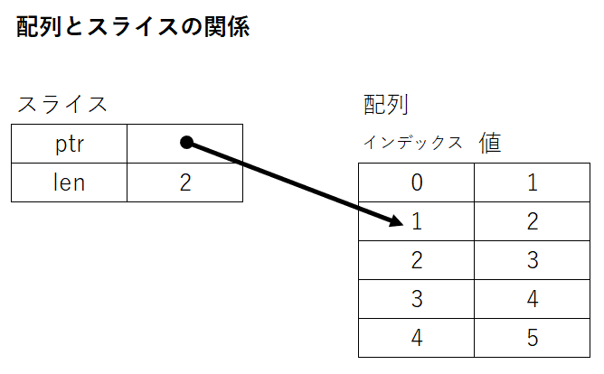

# Rustの学習ノート

## Rust開発環境の構築方法

### 必要なもの

以下のサイトから必要なものをダウンロードし、インストールする。

- [Rust公式サイト](https://www.rust-lang.org/ja)
- [Visual Studio Code](https://azure.microsoft.com/ja-jp/products/visual-studio-code/)、および以下の拡張機能
  - rust-analyzer（作者：The Rust Programming Language）
  - CodeLLDB（作者：Vadim Chugunov）

### Rustツールチェインのインストール手順

ツールチェインとは「ソフトウェア開発に必要な一連のツールセット」のことを言い、Rustツールチェインには

- Rustコンパイラ（rustc）
- ビルドツール兼パッケージマネージャー（Cargo）
- コンパイル済み標準ライブラリ など

が含まれる。

#### リンカのインストール

RustコンパイラはCコンパイラのリンカを利用するため、Rustをインストールする前にCコンパイラのリンカをインストールしなければならない。

LinuxでRustを利用する場合、以下のコマンドでCコンパイラをインストールすれば、同時にリンカもインストールできる。

```shell
# LinuxにRustをインストールする場合、Cコンパイラをインストールする。
$ sudo apt install build-essential
```

WindowsでRustを利用する場合、Rustのインストール時にVisual Studioを同時にインストールできるので、事前になにか行う必要はない（ただし、普通にインストールできない環境では公式サイトの特別な手順に従わなければならない）。

#### Rustツールチェインのインストール

公式サイトからRustツールチェインをダウンロードし、インストールする。

- Install Rust
  <https://www.rust-lang.org/ja/tools/install>

Windowsの場合、`rustup-init.exe`を実行して指示に従えばよい。

ただし、何も考えずにインストールを進めると、同時にVisual Studio 2022をインストールすることになる。個人でRustを使うのであればCommunity版を利用すればよいが、会社等で利用するのであれば「Visual Studio C++ Build tools」を利用する方法でインストールしなければならないだろう。

#### クロスビルドツールチェインのインストール

必要に応じてクロスビルド用のツールチェインをインストールする。例えば、Linux向けのAARCH64をターゲットにしたければ、以下のように`rustup`コマンドを実行すればよい。

```shell
# ターゲットを追加するコマンド。
$ rustup target add aarch64-unknown-linux-gnu
```

追加可能なターゲットは`rustup target list`で表示できる。

コマンドのヘルプは`rustup --help`で表示できるが、より詳しく`rustup`について知りたいのであれば [The rustup book](https://rust-lang.github.io/rustup/index.html) を参照すること。

#### Visual Studio Codeのインストール

エディタとしてVisual Studio Codeをインストールする。そして、以下の拡張機能をインストールすれば、Rustの環境構築は完了である。

- [Visual Studio Code](https://azure.microsoft.com/ja-jp/products/visual-studio-code/)、および以下の拡張機能
  - rust-analyzer（作者：The Rust Programming Language）
  - CodeLLDB（作者：Vadim Chugunov）

## cargoの使い方

cargoとは、Rustのビルドツール、およびパッケージマネージャーのこと。色々できるので、主だったところを紹介する。

| cargoコマンド | 効果 |
| --- | --- |
| `cargo new [オプション] <フォルダ名>` | 指定したフォルダを新規作成し、パッケージを構築する。 オプション指定なしだとバイナリクレート、`--lib`を指定するとライブラリクレートのパッケージとなる。 |
| `cargo init [オプション] <フォルダ名>` | 指定したフォルダへパッケージを構築する。 オプション指定なしだとバイナリクレート、`--lib`を指定するとライブラリクレートのパッケージとなる。 |
| `cargo check` | ソースコードの内容をチェックし、コンパイルエラーがあれば表示する。 |
| `cargo build` | ソースコードをビルドする。 |
| `cargo run` | ソースコードをビルドし、出来上がった実行可能ファイルを実行する。 |
| `cargo test [テスト名]` | テストを実行する。 |
| `cargo doc` | パッケージのドキュメントを出力する。 |

これらに加えてサブコマンド（`cargo install cargo-generate`のようなもの）まである。とりあえず、「何か色々できるのだなあ」と認識しておけばよいだろう。

## プロジェクト（パッケージ）の構成

Rustのプロジェクト（パッケージ）は以下の構成をとる。

| No | 用語 | 意味 |
| --- | --- | --- |
| (1) | パッケージ | クレートのビルド・テスト・共有を可能にするためのCargoの単位のこと。 |
| (2) | Cargo.toml | パッケージのメタデータや、パッケージをビルドするために必要な外部クレートへの依存関係を記述する。 パッケージのマニフェストと呼ばれる。 |
| (3) | クレート | パッケージに1つのまとまりの機能を提供する単位で、ルートモジュールをトップとしたモジュールのツリーのこと。 ルートモジュールが`main.rs`であれば実行バイナリ、それ以外の場合はライブラリを構成する。 |
| (4) | モジュール | クレート内でプログラムを構造化したもの。構造体や関数などのスコープや可視性を制御する。 |
| (5) | 外部クレート | 主に [crates.io](https://crates.io/) で公開されているクレートのこと。 |
| (6) | stdクレート | Rustの標準ライブラリを提供するクレートのこと。 |


## Rustの文法

文 = statement、式 = expressoin。式は値を返す。";"を末尾に付与すると文として扱われる。

### let, const, static

#### 変数

```rust
let 変数名[:型] = 値;
let mut 変数名[:型][ = 値];
```

`let`文で値を変数に束縛する（C言語等では「値を変数に代入する」と表現するが、Rustでは「値を変数に束縛する」と言う）。束縛 = bind、代入 = assign。

変数はデフォルトでイミュータブル（immutable：後から変更できない）で、変更可能な変数を利用する場合はキーワード`mut`を付与した`let mut`文で変数を束縛すればよい。

変数の型はRustコンパイラが型推論して決定する。そのため、明示しなくてもよい。ただし、型推論で解決できない場合もあるので、その際は型を明記しないとコンパイルエラーになる。

```rust
fn main() {
  let x = 1;
  println!("x = {}", x);

  let y:i32 = 2;
  println!("y = {}", y);

  let mut z = 3;
  println!("z = {}", z);
  z = 0;
  println!("z = {}", z);
}
```

#### 定数

```rust
const 定数名:型 = 値;
```

`const`文で定数を定義する。定数には常に不変な値が束縛される。値が不変なため、キーワード`mut`は指定できない。また、定義時に型の指定が必要。

定数名はすべて大文字にする慣例がある。

```rust
const C_ONE:i32 = 1;

fn main() {
  println("C_ONE = {}", C_ONE);
}
```

#### static変数

```rust
static グローバル変数名:型 = 値;
static mut グローバル変数名:型 = 値;
```

`static`文でグローバル変数を束縛する。`const`文と同じように型の指定が必要だが、定数ではないのでキーワード`mut`を指定して可変なグローバル変数を作ることも可能。ただし、可変なグローバル変数へのアクセスは安全でないため、可変なグローバル変数へアクセスする場合は`unsafe`ブロックで囲む必要がある。

static変数も定数と同じく、すべて大文字にする慣例がある。

```rust
static mut x:i32 = 1;

fn main() {
  unsafe {
    x += 1;
    println!("x = {}", x);
  }
}
```

### プリミティブ型

プリミティブ型とは、Rustが言語内部に備えているデータ型のこと。

#### 整数型

"i"と"u"は符号の有無を、そのあとに続く数値はビット幅を表現する。

- 符号あり整数：`i8`、`i16`、`i32`、`i64`、`isize`
- 符号なし整数：`u8`、`u16`、`u32`、`u64`、`usize`

`isize`と`usize`は環境によってビット幅が変わる。32ビット環境なら32ビット幅、64ビット環境なら64ビット幅をとる。

整数リテラルの記述方法は以下の通り。"_"は桁区切り文字で、任意の場所に挿入することができる。

```rust
fn main() {
  let x_10 = 12_345_678;   // 10進数。
  let x_16 = 0xffff_ff00;  // 16進数。
  let x_8 = 0o77;          // 8進数。
  let x_2 = 0b0011;        // 2進数。
  let x_bytes = b'A';      // バイト。
}
```

#### 浮動小数点型

浮動小数点は32ビットと64ビットの範囲をサポートしている。浮動小数点リテラルは、デフォルトで`f64`に型推論される。

- 浮動小数点：`f32`、`f64`

実行速度にも差はないので、通常は`f64`を使えばよいのだが、組み込み機器のような変数幅に制限のある環境では明示的に`f32`を使わなければいけないこともある。

```rust
fn main() {
  let x = 3.141592;
  println!("x = {:.2}", x);  // {:.桁数}で小数点の出力桁数を指定できる。
}
```

#### bool型

`true`と`false`がある。

- bool型：`true`、`false`

```rust
fn main() {
  let is_true = true;
  if is_true == true {
    println!("is_true = {}", is_true);
  }
}
```

#### 配列型

```rust
let 配列名[: \[型名; 要素数\]] = \[値1, 値2, ... 値n\];
let mut 配列名[: \[型名; 要素数\]] = \[値1, 値2, ... 値n\];
```

同じ型の値を複数持つための型。要素数は固定で、一度作ってしまうと配列の要素数は増やすことも減らすこともできない。

配列の要素へアクセスする場合、インデックスは0から始まる。

```rust
fn main() {
  let array = [1, 2, 3, 4, 5];
  println!("array = {:?}", array);
  println!("array[0] = {}", array[0]);

  let mut m_array = [6, 7, 8, 9, 10];
  m_array[0] = 99;
  println!("m_array = {:?}", m_array);
}
```

#### スライス型

```rust
let スライス名[: &\[型\]] = &配列変数名\[参照範囲\];
let スライス名[: &\[型\]] = &mut 配列変数名\[参照範囲\];
```

スライス型は配列と同様に同じ型を複数扱うための方法で、その実体は配列の一部への参照である。`mut`を指定する位置がこれまでと異なるのがポイント。

スライス自体は下図のように配列のインデックスへのポインタと参照する長さを持つだけで、値を直接持つわけではない。



ある配列の1番目から2番目までの範囲をスライス化する場合、以下のようなコードとなる。

```rust
fn main() {
  let array = [1, 2, 3, 4, 5];
  let slice = &array[1..3];

  println!("slice = {:?}", slice);      // slice = [2, 3]
  println!("slice[0] = {}", slice[0]);  // slice[0] = 2

  let mut m_array = [6, 7, 8, 9, 10];
  let m_slice = &mut m_array[1..3];

  println!("m_slice = {:?}", m_slice);  // m_slice = [7, 8]
  m_slice[0] = 100;
  println!("m_slice = {:?}", m_slice);  // m_slice = [100, 8]
  println!("m_array = {:?}", m_array);  // m_array = [6, 100, 8, 9, 10]
}
```

#### タプル型

```rust
let タプル名[: (型, 型, 型,...)] = (値, 値, 値,...);
let mut タプル名[: (型, 型, 型,...)] = (値, 値, 値,...);
```

タプル型は配列と似ているが、こちらは複数の**異なる型**を持つための型。各要素の型と要素数は固定で、一度作ってしまうとタプルの型は変更できず、かつ要素数を増やすことも減らすこともできない。

タプルの要素へアクセスする際は、「タプル名.インデックス」と記述する。

```rust
fn main() {
  let tuple = (1, 10, "Hello");
  let mut m_tuple: (u8, usize, &str) = (8, 32, "World");

  println!("tuple = {:?}", tuple);
  m_tuple.0 = 255;
  println!("m_tuple = {:?}", m_tuple);
}
```

#### 文字列型

##### 文字列リテラル

```rust
let 文字列リテラル名 = "文字列";
```

ダブルクォーテーションで囲んだ文字列は文字列リテラルとなる。文字列リテラルは書き込み禁止領域に廃止されるため、`mut`をつけることはできない。

```rust
fn main() {
  let str = "Hello";
  println("{}", str);
}
```

##### 文字のバイト配列

```rust
let バイト配列名 = b"文字列";
```

文字列リテラルをu8のバイト配列として変数に束縛することができる。

```rust
fn main() {
  let bastr = b"Hello";
  println!("bastr = {:?}", bastr); // bastr = [72, 101, 108, 108, 111]
}
```

### 制御フロー

#### if...else if...else

```rust
if 条件 {
  // 処理
} else if 条件 {
  // 処理
} else {
  // 処理
}
```

C言語などとは異なり、条件をかっこで囲まないのがポイント。また、Rustのifは式（expression）であり、値を返すことができる。つまり、いわゆる3項演算子的な記述が可能。

```rust
fn main() {
  let x = 10;
  let y = if x > 10 { "x > 10" } else { "x <= 10" };
  println!("y = {}", y);
}
```

#### loop

```rust
loop {
  // 処理
  [break;]
  [continue;]
}
```

`loop`文は単純に繰り返しを実現する文。`break`でループを抜け、`continue`でループの先頭行に戻る。

`break`しないと無限ループになるので、if式と併せて`break`する判定を追加するのが通常の使い方となる。

```rust
fn main() {
  let mut x = 0;
  loop {
    if x > 10 {
      break;
    }
    x += 1;
  }
  println!("finish.");
}
```

#### while

```rust
while 条件式 {
  // 処理
  [break;]
  [continue];
}
```

`while`文は条件式を満たす間ブロック内の処理を繰り返す。`loop`文と同じく、`break`と`continue`を記述できる。

```rust
fn main() {
  let mut x = 0;
  while x < 10 {
    x += 1;
  }
  println!("finish.");
}
```

#### for

```rust
for 変数 in イテレータ {
  // 処理
  [break;]
  [continue;]
}
```

`for`文はVBの`ForEach...In`文やJavaScriptの`for...of`文のように、イテレータから受け取った各要素に対して処理を繰り返す。

例えば、以下のように整数の範囲を指定することもできる。各要素はループごとに変数`x`へ束縛される。

```rust
fn main() {
  for x in 0..5 {
    // 何もしない。
  }
  println!("finish.");
}
```

急に`..`演算子が登場した。これは`start..end`の範囲の`Range`型オブジェクトを作っている。`1..5`で1から4まで、`1..=5`で1から5までの範囲を表現する。

イテレータを取得するメソッドは次の3つがよく使われる。

- `iter()`：要素に`&T`でアクセスするイテレータを取得する
- `iter_mut()`：要素に`&mut T`でアクセスするイテレータを取得する
- `into_iter()`：要素に`T`でアクセスするイテレータを取得する（元のオブジェクトの所有権をムーブする）

### 関数

```rust
fn 関数名([引数:型][, 引数:型][, ...])[ -> 戻り値の型] {
  // 処理
  [戻り値]
}
```

Rustの仕様として、セミコロンを付けた文は`()`型、ユニット型と評価されてしまう。ユニット型はつまり、文として扱われる。

セミコロンを付けなければ式扱いになるので、返却したい処理はセミコロンをつけずに記述すればよい。

なお、キーワード`return`も存在しているのだが、慣例的に通常は使わない。通常でない処理、例えばある種のエラー処理を行う場合などに`return`を付与して文にする。

```rust
fn main() {
  println!("number = {}", double(10));
}

fn double(number: u32) -> u32 {
    if number > u32::MAX / 2 {
        return u32::MAX; // 特別なパターンなのでreturnを付与する。
    }
    number * 2 // 通常のパターンは式として記述する。
}
```

### コメント

```rust
// 行コメント
/*
   複数行コメント
*/
/// ドキュメンテーションコメント
```

`cargo doc`でドキュメントを出力できる。`//!`コメントもあるが、詳細はTODO。

### 構造体

#### struct

```rust
struct 構造体名 {
  フィールド名: フィールド型,
  フィールド名: フィールド型,
  ...,
}

let 変数名 = 構造体名 {
  フィールド名: 値,
  フィールド名: 値,
  ...,
}
```

`struct`キーワードで構造体を定義する。フィールドとは構造体に含まれるデータのことで、構造体オブジェクトを変数に束縛した後は「変数名.フィールド名」の形でアクセスする。

```rust
struct Sensor {
  active: bool,
  latest: u32,
}

fn main() {
  let sensor = Sensor {
    active: false,
    latest: 0,
  };
  println!("sensor.active = {}, sensor.latest = {}", sensor.active, sensor.latest);
}
```

#### impl

`impl`文で構造体へメソッドと関連関数を定義する。`impl`はimplementation（実装）を意味する。

##### メソッド

```rust
impl 構造体名 {
  fn 関数名(&self, [引数,...])[ -> 戻り値型] {
    // 処理
  }
}
```

メソッドは構造体に紐づく関数で、第1引数へ常に構造体オブジェクト自身を表す`&self`が入る。オブジェクト自身の値を変更する場合、`&mut self`を第1引数に指定する。

```rust
struct Sensor {
  active: bool,
  latest: u32,
}

impl Sensor {
  fn read(&self) -> u32 {
    self.latest
  }

  fn clear(&mut self) {
    self.active = false;
    self.latest = 0;
  }
}

fn main() {
  let mut sensor = Sensor {
    active: true,
    latest: 50,
  };
  println!("sensor.active = {}, sensor.latest = {}", sensor.active, sensor.read());
  sensor.clear();
  println!("sensor.active = {}, sensor.latest = {}", sensor.active, sensor.read());
}
```

##### 関連関数

```rust
impl 構造体名 {
  fn 関数名([引数,...])[ -> 戻り値型] {
    // 処理
  }
}
```

関連関数も構造体に紐づく関数だが、第1引数で`&self`を受け取らない。典型的な利用方法はコンストラクタで、Rustでは慣例的に`new()`と命名する。

また、呼び出し時は「構造体名::関連関数名()」となる。多言語でいうstatic methodのようなイメージ。構造体オブジェクトを受け取る必要がないのでこうなる。

```rust
struct Sensor {
  active: bool,
  latest: u32,
}

impl Sensor {
  fn new() -> Sensor {
    Sensor {
      active: false,
      latest: 0,
    }
  }

  fn read(&self) -> u32 {
    self.latest
  }

  fn clear(&mut self) {
    self.active = false;
    self.latest = 0;
  }
}

fn main() {
  let mut sensor = Sensor::new();
  println!("sensor.active = {}, sensor.latest = {}", sensor.active, sensor.read());
}
```

### 列挙型


## 組み込み機器向けにRustを利用するための情報

### 標準ライブラリの構造

Rustの標準ライブラリは以下の3レベル構造で提供されている。


`core`クレートと`alloc`クレートは`std`クレートのサブセットである。

最も下層の`core`クレートは前提条件なしで利用できる。ただし、整数型やスライスのようなプリミティブ型や、アトミック操作のようなプロセッサ機能を利用する処理しか提供されていない（OSやCPUといったプラットフォームに依存しない処理しか提供されていない）。

`alloc`クレートは`Box`型や`Vec`型といったヒープメモリを利用する型を提供する。`alloc`クレートを利用するには、メモリアロケーターの実装が必要となる。

`std`クレートはファイルシステムやネットワーク、スレッドといったOS機能を提供する。`println!`マクロやコマンドライン引数を渡すインターフェースも`std`クレートの役割である。`std`クレートを利用するためにはOSが必要となる。

通常は考慮不要だが、OSが載っていない組み込み機器向けにアプリケーションを作成する際には、これらを考慮しなければならない。

### unsafeブロック

FPGAボードなどを利用する際はハードウェアを直接制御することになるが、その場合「Rustコンパイラが安全でないとみなすコード」を記述する必要がある。そのために利用するのがunsafeブロックで、以下のように記述する。もちろん、記述内容の安全性は記述者であるプログラマーが保証しなければならない。

```rust
unsafe {
  // 安全でない操作を記述できる。
  // 操作の安全性はプログラマーが保障する。
}
```

なお、どんなコードでも書けるわけではなく、以下の5つの動作のみが許されている。

1. ハードウェア（メモリ）の直接操作
1. 可変なグローバル変数（static mut）へのアクセス
1. 安全でない関数（C言語の関数など）を呼び出す
1. unsafeなトレイトを実装する
1. Unionへアクセスする

メモリマップドIOを操作するために、特に1番目の操作が重要となる。

## 参考資料

### 参考文献

1. 中林 智之 / 井田 健太, 基礎から学ぶ組込みRust, 株式会社シーアンドアール研究所, 2021/04/30 初版発行, ISBN978-4-86354-337-9 C3055
1. クジラ飛行机, 手を動かして考えればよくわかる 高効率言語Rust書き方・作り方, ソシム株式会社, 2022/02/08 初版第2刷発行, ISBN978-4-8026-1351-4 / <https://lib.rs/crates/rpn_calc_53tanuki>

### Rust公式資料

1. -, The rustup book, -, -, <https://rust-lang.github.io/rustup/index.html>
1. -, The Cargo Book, -, -, <https://doc.rust-lang.org/cargo/index.html>
