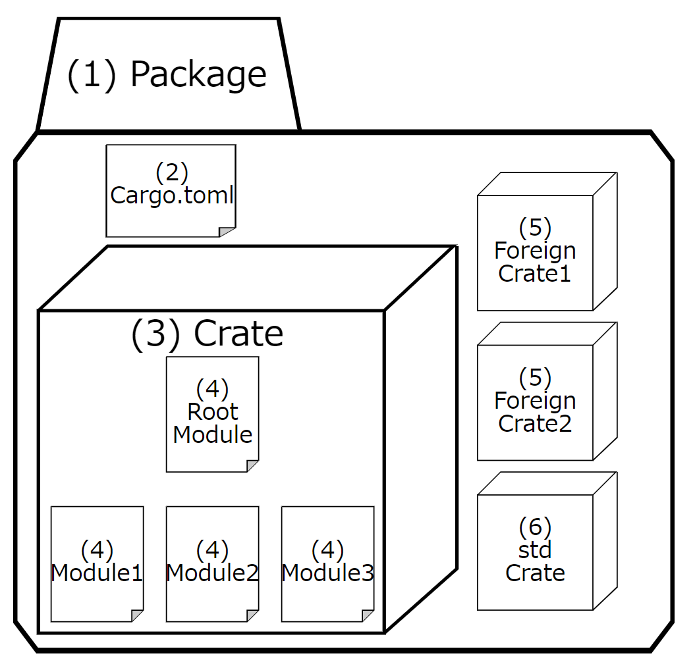
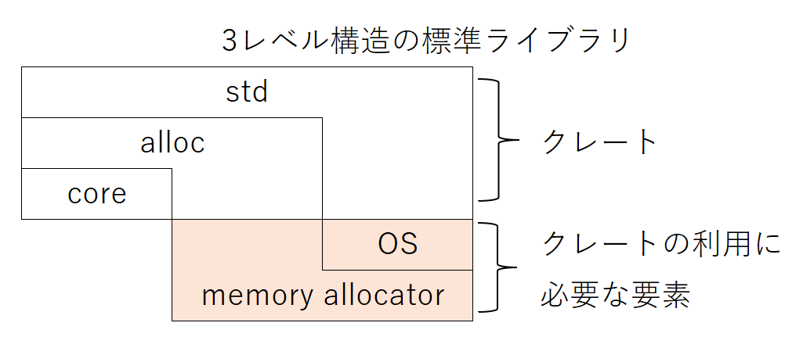

# Rustの学習ノート

## プロジェクト（パッケージ）の構成

| No | 用語 | 意味 |
| --- | --- | --- |
| (1) | パッケージ | クレートのビルド・テスト・共有を可能にするためのCargoの単位のこと。 |
| (2) | Cargo.toml | パッケージのメタデータや、パッケージをビルドするために必要な外部クレートへの依存関係を記述する。パッケージのマニフェストと呼ばれる。 |
| (3) | クレート | パッケージに1つのまとまりの機能を提供する単位で、ルートモジュールをトップとしたモジュールのツリーのこと。ルートモジュールが`main.rs`であれば実行バイナリ、それ以外の場合はライブラリを構成する。 |
| (4) | モジュール | クレート内でプログラムを構造化したもの。構造体や関数などのスコープや可視性を制御する。 |
| (5) | 外部クレート | 主に [crates.io](https://crates.io/) で公開されているクレートのこと。 |
| (6) | stdクレート | Rustの標準ライブラリを提供するクレートのこと。 |

## 標準ライブラリの構造

Rustの標準ライブラリは以下の3レベル構造で提供されている。

`core`クレートと`alloc`クレートは`std`クレートのサブセットである。

最も下層の`core`クレートは前提条件なしで利用できる。ただし、整数型やスライスのようなプリミティブ型や、アトミック操作のようなプロセッサ機能を利用する処理しか提供されていない（OSやCPUといったプラットフォームに依存しない処理しか提供されていない）。

`alloc`クレートは`Box`型や`Vec`型といったヒープメモリを利用する型を提供する。`alloc`クレートを利用するには、メモリアロケーターの実装が必要となる。

`std`クレートはファイルシステムやネットワーク、スレッドといったOS機能を提供する。`println!`マクロやコマンドライン引数を渡すインターフェースも`std`クレートの役割である。`std`クレートを利用するためにはOSが必要となる。

通常は考慮不要だが、OSが載っていない組み込み機器向けにアプリケーションを作成する際には、これらを考慮しなければならない。
